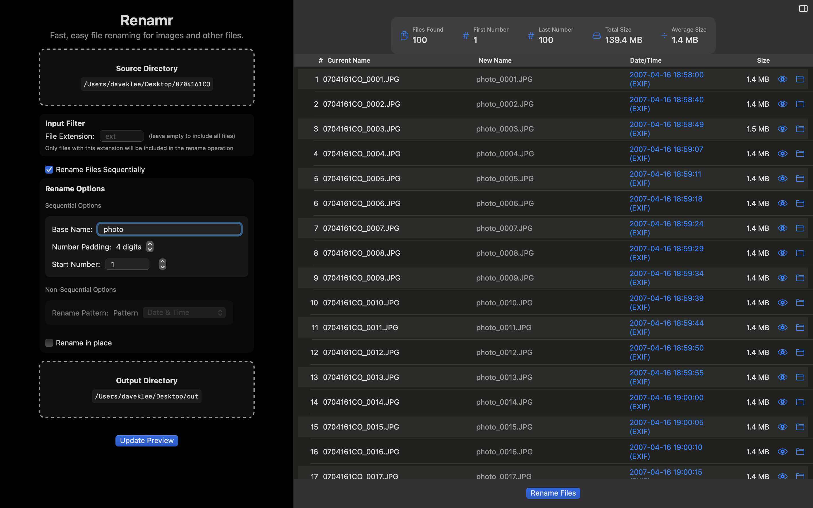

# Renamr

**Version 1.2.3**

## What's New in 1.2.3
- Performance improvements for file scanning and renaming operations
- Batch processing of files to reduce UI updates
- Source directory is now cleared after renaming completes
- Improved progress reporting during file operations
- Memory optimizations for large directories

## What's New in 1.2.2
- Preview table shows file date/time used for sorting, and indicates if EXIF was used.
- Alternating row backgrounds for better readability.
- Real-time progress bar and status for both scanning and renaming.
- Quick Look preview for files (eye icon or spacebar on button).
- Clickable drop zones for both source and output directories (opens folder picker or supports drag-and-drop).
- Output files are copied (not moved) when 'rename in place' is unchecked.
- Files are always renamed in oldest-first order (EXIF date, then creation date, then filename).
- Table shows file size and sequential number.
- Improved macOS look and feel.
- Improved UI clarity for file extension input filter and sequential/non-sequential options
- Date-based renaming now uses EXIF date, then file creation date only (no modification/current date fallback)
- Fixed Swift 6 warnings and improved async test compatibility
- Various bug fixes and code cleanup

A modern macOS application for batch file renaming with a focus on images and other files. Renamr features a clean, intuitive interface and powerful renaming capabilities.

## Features

- **Clean, Modern Interface**: Drag-and-drop UI with native macOS controls
- **Smart Sequential Renaming**: 
  - Automatic underscore insertion between basename and number
  - Automatic basename suggestion from folder name
  - Configurable number padding and start number
  - Files processed in date order (oldest first)
- **Non-Sequential Options**:
  - Date & Time based naming (using EXIF data when available)
  - Random unique name generation
- **File Management**:
  - Rename in place or to a separate output directory
  - File extension filtering
  - Support for all file types with special handling for images
- **Progress Tracking**: Real-time progress monitoring for large batches
- **Dark/Light Mode Support**: Automatically adapts to your macOS appearance settings

## Requirements

- macOS 12.0 or later
- 64-bit processor
- Permissions to access files/folders you want to rename

## Installation

1. Download the latest release from the [Releases](https://github.com/timelapsetech/renamr/releases) page
2. Drag Renamr.app to your Applications folder
3. Launch from Applications or Spotlight

## Usage

### Basic Renaming
1. Drag and drop a source folder onto the Source Directory zone
2. Choose between sequential or non-sequential renaming
3. Configure your renaming options
4. Click "Start Renaming"

### Sequential Renaming
- Enter a base name (e.g., "Photo")
- The app will automatically add an underscore before the number
- Set the number padding (e.g., 3 digits: 001, 002, etc.)
- Choose a starting number
- Files will be processed in date order (oldest first)

### Non-Sequential Renaming
- **Date & Time**: Names files based on their capture date or modification date
- **Random**: Generates unique random names with configurable length

## Version History

### 1.1.1
- Removed photos library access requirement
- Improved security by removing unnecessary entitlements

### 1.1.0
- Added automatic underscore insertion
- Added automatic basename suggestion from folder name
- Improved window sizing and layout
- Simplified renaming interface
- New application icon

### 1.0.0
- Initial release

## Development

### Setup
1. Clone the repository
2. Open `Renamr.xcodeproj` in Xcode
3. Build and run the project

### Requirements
- Xcode 14.0 or later
- Swift 5.5+

## Credits

- Icon design: Time Lapse Technologies
- Developer: Time Lapse Technologies

## License

Copyright © 2024 Time Lapse Technologies. All rights reserved. 